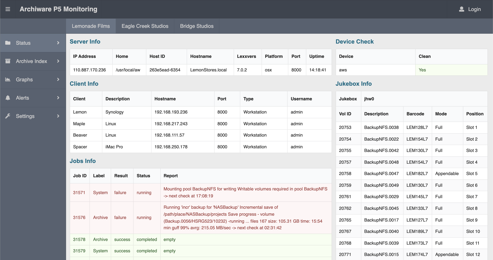

# Archiware P5 Monitoring Dashboard 🎞 🗃 🧑‍💻

The Archiware P5 Suite provides data management for those in the media and entertainment industry to conveniently archive and backup. Workstation clients can backup and retrieve files from a main company server.

This project is setup to monitor three companies at the same time without logging into each server each time and navigating status reports.

Built to interact wih the [Archiware P5 REST API](https://blog.archiware.com/redoc/p5_rest_api/awp5api.html).

### Demo
Run the demo branch to generate mock data locally or run the main branch to attach your own servers.




### Run Instructions

See the .env.example to make your own .env file. App template includes three servers to start, more can also be added to the ServerMenu component.

Run by navigating to the server and client folders and type:

```
$ npm install
$ npm run start
```
